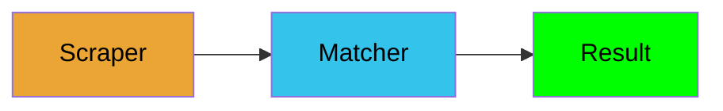
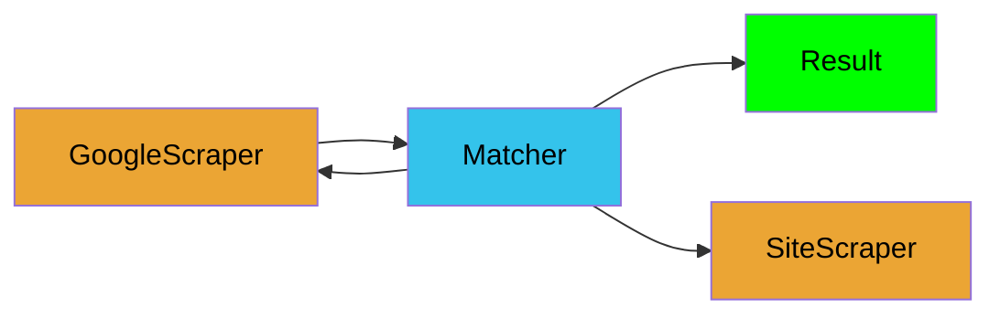

# com2site

## Abstract

This repository contains tool for finding company's site by company name and address.

Formalization:
```
F(c1, c2, ..., cn) = [s1, s2, ..., sn]
```
Where:
 - `c{i}` - ith company, `c{i} = (n{i}, a{i})` where:
   - `n{i}` - name of `c{i}` company.
   - `a{i}` - Address of `c{i}` company.
 - `s{i}` - site of `c{i}` company.

## Quickstart
### Installation

```bash
git clone https://github.com/icune/csm
cd csm
pip install -r requirements.txt
export PYTHONPATH=$(pwd)
```

### Launch scraper

Put companies.csv into `gmatch/gmatch/spiders/data/companies.csv`
It must have next structure:
```csv
Company Name,,Company Address
Some Name,,"Some address"
```

Then launch scraper:

```bash
cd gmatch/gmatch
scrapy crawl gmatch
```

### Launch matcher script

```bash
cd gmatch/analytics/hypothesis
python url_n_title_hypothesis.py 
```

It will save results into `gmatch/analytics/hypothesis/data/result_url_n_title_hypotesis.csv`.

## Implementation

Project consists of two parts:
1. Scraper - searches Google for companies.
2. Matcher - script that analyses search results and finds corresponding sites.

### Scraper

How it works:
1. Takes companies from CSV file
2. Searches information about them in Google
3. Saves it into database.

### Matcher

How it works:
1. Gets search results from database
2. Creates `DSL` domain stop list:
   1. Automatic stop list:
      1. All links from search results concatenated
      2. For every link from previous step domain is taken
      3. If domain occurs more than once - added to stop list
   2. Manual stop list:
      1. Results of matcher manually viewed and domains of search engines excluded.
   3. Domain stop list = Automatic stop list + Manual stop list.
3. For every company from database:
   1. Take it search list from database
   2. Exclude from this search list domains from `DSL`
   3. Find matching URL:
      1. Split name of the company (`Prime Care Technologies` -> `prime` `card` `technologies`)
      2. Remove from splitted name stop words (like `llc`, `inc`, etc.)
      3. Find domain in search list, that contains at least one of words from previous step.
   4. Find out if company name appears in short description (text under the link in Google search)

## Problems

### Architecture

Current:



What problems of this architecture:
 - It cannot serve case when matcher needs additional search links. For example, if site is not located on the first page.
 - If matcher is unable to make conclusion from only search results, it has to visit probable candidate sites.

How to improve:



Where:
 - GoogleScraper - scraper of Google search results.
 - Matcher - Matcher.
 - SiteScraper - Scraper, that takes personal links, scrapes them and returns information to Matcher.


### Domain stop list

Currently, if sites refers to each other, they will appear in stop list.
For example, take comanies A and B.
If their sites refer to each other, they will appear in DSL.

### Not only Google

Except Google, there're other sources, for example Angellist, LinkedIn, etc.
To make parser confident, we can take data from several sources and compare results.


